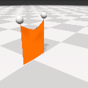
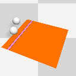
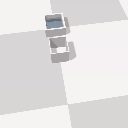
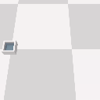
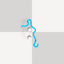

# SoftGym

## Using Docker
If you are using Ubuntu 16.04 LTS and CUDA 9.2, you can follow the steps in the next section on this page for compilation. For other versions of Ubuntu or CUDA, we provide the pre-built Docker image and Dockerfile for running SoftGym. Please refer to our [Docker](docker/docker.md) page.

## Instructions 
1. This codebase is tested with Ubuntu 16.04 LTS, CUDA 9.2 and Nvidia driver version 440.64. Other versions might work but are not guaranteed, especially with a different driver version. Please use our docker for other versions.

The following command will install some necessary dependencies.
```
sudo apt-get install build-essential libgl1-mesa-dev freeglut3-dev
```

2. Create conda environment
Create a conda environment and activate it: `conda env create -f environment.yml`

3. Compile PyFleX: Go to the root folder of softgym and run `. ./prepare_1.0.sh`. After that, compile PyFleX with CMake & Pybind11 by running `. ./compile_1.0.sh` Please see the example test scripts and the bottom of `bindings/pyflex.cpp` for available APIs.

### Run test examples    
To have a quick view of different tasks listed in the paper (with random actions):  
For SoftGym-Medium:  
- TransportWater: `python examples/random_env.py --env_name PassWater`
- PourWater: `python examples/random_env.py --env_name PourWater`
- StraightenRope: `python examples/random_env.py --env_name RopeFlatten`
- SpreadCloth: `python examples/random_env.py --env_name ClothFlatten`
- FoldCloth: `python examples/random_env.py --env_name ClothFold`
- DropCloth: `python examples/random_env.py --env_name ClothDrop`  

For SoftGym-Hard:  
- PourWaterAmount: `python examples/random_env.py --env_name PourWaterAmount`
- FoldCrumpledCloth: `python examples/random_env.py --env_name ClothFoldCrumpled`
- DropFoldCloth: `python examples/random_env.py --env_name ClothFoldDrop`
- RopeConfiguration: `python examples/random_env.py --env_name RopeConfiguration`  
Please refer to `softgym/registered_env.py` to find the default parameters and source code files for each of these envs.

### Task Demos
From Left to Right:  
----- DropCloth --------- FoldCloth ---------- SpreadCloth ------ PourWater ------ TransportWater ------ StraightenRope  
       

## References
- NVIDIA FleX - 1.2.0: https://github.com/NVIDIAGameWorks/FleX
- Our python interface builds on top of PyFleX: https://github.com/YunzhuLi/PyFleX
